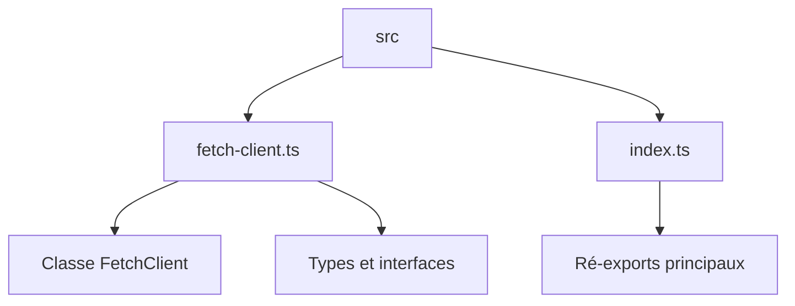

Voici une documentation GitHub structurée pour votre projet **Web-toolkit**, basée sur les fichiers fournis. Je vais suivre une approche méthodique avec des sections claires et des éléments visuels pour faciliter la compréhension.

---

# 📦 Web-toolkit Documentation

> "Modern utilities and HTTP fetch helpers for Next.js projects." 🚀

## 🎯 Overview

**Web-toolkit** est une bibliothèque TypeScript moderne pour Next.js, offrant des utilitaires HTTP avancés avec :
- Gestion des requêtes avec réessais automatiques
- Validation des réponses
- Support multi-format (JSON, text, blob, arrayBuffer)
- Configuration flexible

**Technologies clés** :
- TypeScript
- Next.js
- tsup (pour le bundling)
- GitHub Actions (CI/CD)

---

## 🛠️ Installation

```bash
npm install @rokat/web-toolkit
# ou
yarn add @rokat/web-toolkit
```

**Prérequis** :
- Node.js LTS
- Next.js 12+

---

## 📂 Structure du Projet



---

## 🔧 Configuration

### 🏗️ `tsup.config.ts`

```typescript
export default defineConfig({
  entry: ['src/index.ts'],
  format: ['esm', 'cjs'],
  dts: true,
  sourcemap: true,
  clean: true,
  target: 'es2021'
});
```

**Options clés** :
- `format: ['esm', 'cjs']` → Support ESM et CJS
- `dts: true` → Génération des fichiers `.d.ts`
- `target: 'es2021'` → Compatibilité moderne

---

## 🚀 Utilisation

### 📡 Création d'un client HTTP

```typescript
import { FetchClient } from '@rokat/web-toolkit';

const client = new FetchClient({
  baseUrl: 'https://api.example.com',
  timeout: 5000,
  retry: {
    maxRetries: 3,
    initialDelay: 100,
    maxDelay: 1000,
    jitter: 50
  }
});
```

### 🔄 Requêtes avec réessais

```typescript
try {
  const data = await client.get('/users');
} catch (error) {
  if (isFetchClientError(error)) {
    console.error('Erreur:', error.message);
  }
}
```

---

## 🏗️ Architecture

### 🧩 `src/fetch-client.ts`

**Classe principale** :
```typescript
class FetchClient {
  constructor(options: FetchClientOptions = {})
  async request<T>(url: string, options?: FetchRequestOptions): Promise<T>
  // Méthodes HTTP (get, post, put, delete, etc.)
}
```

**Types clés** :
```typescript
interface FetchClientOptions {
  baseUrl?: string;
  defaultHeaders?: Record<string, string>;
  timeout?: number;
  retry?: RetryOptions;
}

interface RetryOptions {
  maxRetries: number;
  initialDelay: number;
  maxDelay: number;
  jitter: number;
}
```

---

## 🔄 CI/CD

### 🤖 GitHub Actions

**Workflow CI** (`.github/workflows/ci.yml`) :
```yaml
name: CI
on:
  push:
    branches: [ main, master ]
  pull_request:
    branches: [ main, master ]
```

**Workflow Release** (`.github/workflows/release.yml`) :
```yaml
name: Release
on:
  push:
    tags:
      - 'v*.*.*'
```

---

## 📜 Documentation Technique

### 📄 `src/index.ts`

**Ré-exports principaux** :
```typescript
export { FetchClient } from './fetch-client';
export { createFetchClient } from './fetch-client';
export { createJsonFetcher } from './fetch-client';
export { FetchClientError, isFetchClientError } from './fetch-client';
```

**Types exportés** :
```typescript
export type {
  FetchClientOptions,
  FetchRequestOptions,
  RetryOptions,
  FetchResponse
} from './fetch-client';
```

---

## 🛠️ Maintenance

### 🔄 Mises à jour automatiques

**Dependabot** (`.github/dependabot.yml`) :
```yaml
version: 2
updates:
  - package-ecosystem: "npm"
    directory: "/"
    schedule:
      interval: "weekly"
   open-pull-requests-limit: 5
    versioning-strategy: increase
```

---

## 💡 Questions suggérées

1. Comment configurer un client avec des en-têtes personnalisés ?
2. Quels sont les formats de réponse supportés par défaut ?
3. Comment personnaliser la stratégie de réessai ?

---

**📌 Note** : Cette documentation est générée à partir des fichiers fournis. Pour des détails supplémentaires, consultez les fichiers sources dans le dépôt.